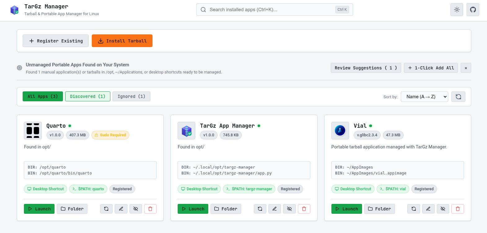

# TarGz Manager

**A zero-dependency web UI for installing, updating, and cleanly removing `.tar.gz` / `.tar.xz` portable Linux applications.**

Linux distributes a lot of software as plain tarballs with no package manager behind them: no `$PATH` entry, no application menu shortcut, no upgrade path, no clean uninstall. TarGz Manager is a small self-hosted tool that fixes that - extract an archive once, and it handles the desktop integration, symlinks, versioning, and removal for you.



## Why

Downloading a pre-built Linux binary as a `.tar.gz` usually leaves you with a folder that has none of the conveniences a proper package gives you:

- No entry in your application launcher (GNOME/KDE/XFCE)
- No command available from the terminal
- No record of what version you have or where you put it
- No clean way to remove it without hunting down loose files

TarGz Manager tracks all of that in a local SQLite database and automates the boring parts.

## Features

- Install `.tar.gz`, `.tgz`, `.tar.xz`, `.tar.bz2`, and `.zip` archives into a clean, isolated directory (`~/.local/opt/<app>/`)
- Auto-detects the main executable and icon inside an archive, with confidence scoring
- Flattens single wrapper folders on extraction (e.g. `blender-4.1.0-linux-x64/`)
- Generates a `.desktop` launcher entry and a `~/.local/bin` symlink
- In-place upgrades with automatic rollback if extraction fails
- One-click clean uninstall (files, shortcut, symlink, and database entry)
- Scans `/opt`, `~/.local/opt`, `~/Applications`, and existing `.desktop` files for apps you already installed by hand, so you can bring them under management
- Full CLI for scripting, alongside the web UI

## Install

Requires Python 3.8+ and nothing else — no `pip install`, no virtualenv.

```bash
curl -fsSL https://raw.githubusercontent.com/aradar46/targz-manager/main/install.sh | bash
```

This clones the repo into `~/.local/opt/targz-manager`, adds it to your application menu, starts the server, and opens `http://127.0.0.1:8421/` in your browser. Run the same command again later to update.

Prefer to do it by hand?

```bash
git clone https://github.com/aradar46/targz-manager.git
cd targz-manager
python3 app.py                    # start the server + open the browser
python3 app.py --install-desktop-entry  # optional: add an app menu entry
```

## CLI

```bash
python3 app.py import-discovered  # find and import unmanaged apps/tarballs on your system
python3 app.py list               # list managed apps
python3 app.py inspect <archive>  # preview an archive without installing it
python3 app.py install <archive>  # install a tarball
python3 app.py update <app> <archive>  # upgrade an app in place
python3 app.py remove <app>        # uninstall cleanly
python3 app.py launch <app>        # launch an app
python3 app.py --install-desktop-entry  # add TarGz Manager itself to your app menu
```

## Where things live

| Resource           | Path                                          |
| ------------------ | --------------------------------------------- |
| Database           | `~/.local/share/targz-manager/apps.db`      |
| Installed apps     | `~/.local/opt/<app>/`                       |
| `$PATH` symlinks | `~/.local/bin/<app>`                        |
| Desktop entries    | `~/.local/share/applications/<app>.desktop` |

## Testing

```bash
python3 -m unittest discover -s tests -p "test_*.py" -v
```

## License

[GPL-3.0](LICENSE) — this is a personal project, built to scratch my own itch. Issues and PRs are welcome but expect it to move at a hobby pace.
# targz-manager
